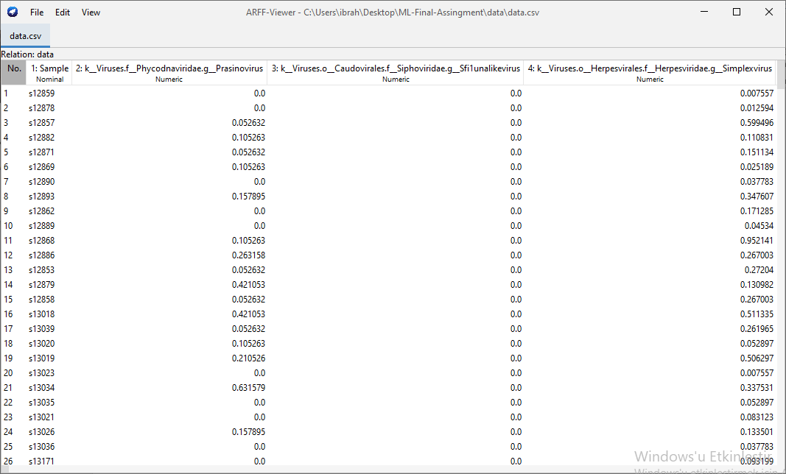

# Introduction to Machine Learning Final Assingment

## Goal
With this project it is expected to have the highest possible correct classification scores. A multi-class classification algorithm will be performed (i.e a single neural network model will be predicting an unknown sample to any of the 4 classes.)

---

## Data
We have blood sample data of 355 people with 4 most common cancer types: Colon cancer, breast cancer,
lung cancer, and prostate cancer.
We are given a label file, labels.csv, indicating the sample names, and the disease type of each person
with the corresponding sample name. The data are stored in data.csv. These files are in data/ folder. Again, each row has the sample name of the corresponding person, and the remaining are the number of DNA fragments belonging to each microorganism type (virus or bacteria). 1836 different microorganisms appear as features. Data in this project is normalized which means each data component divided by the sum of corresponding row.

---

## Classification Algorithms
In this project Neural Networks implemented using scikit-learn. 4 models created with same hyperparameters except their activation function to test activation function impact on performance. These activation functions are {Identity, Relu, Logistic, Tanh}.

---

## Performance Measures
*Precision*, *Recall* and *F2 Scores* given as the output of program performance for each model.
General formula for these measures are;

$$
Precision = \dfrac {correct \ number \ of \ prediction \ of \ the \ disease} {total \ number \ of \ elements \ predicted \ as \ disease}
$$

$$
Recall = \dfrac {correct \ number \ of \ prediction \ of \ the \ disease} {total \ number \ of \ elements \ with \ disease}
$$

$$
F2 \; Score = \dfrac {5 \times Precision \times Recall} {4 \times Precision + Recall}
$$

---

### Performance Measures of the program
$Identity$
| Class           | Precision | Recall | F2 Score |
|-----------------|-----------|--------|----------|
| Breast Cancer   | 1         | 0.84   | 0.868    |
| Colon Cancer    | 0.968     | 0.968  | 0.968    |
| Lung Cancer     | 0.6       | 1      | 0.882    |
| Prostate Cancer | 0.875     | 0.933  | 0.921    |

$Logistics$
| Class           | Precision | Recall | F2 Score |
|-----------------|-----------|--------|----------|
| Breast Cancer   | 1         | 0.92   | 0.935    |
| Colon Cancer    | 0.969     | 1      | 0.994    |
| Lung Cancer     | 0.6       | 1      | 0.822    |
| Prostate Cancer | 0.966     | 0.933  | 0.940    |

$Tanh$
| Class           | Precision | Recall | F2 Score |
|-----------------|-----------|--------|----------|
| Breast Cancer   | 1         | 0.88   | 0.901    |
| Colon Cancer    | 0.968     | 1      | 0.993    |
| Lung Cancer     | 0.428     | 1      | 0.789    |
| Prostate Cancer | 0.928     | 0.866  | 0.878    |

$Relu$
| Class           | Precision | Recall | F2 Score |
|-----------------|-----------|--------|----------|
| Breast Cancer   | 0.956     | 0.88   | 0.894    |
| Colon Cancer    | 0.968     | 1      | 0.993    |
| Lung Cancer     | 0.5       | 1      | 0.833    |
| Prostate Cancer | 0.928     | 0.866  | 0.878    |